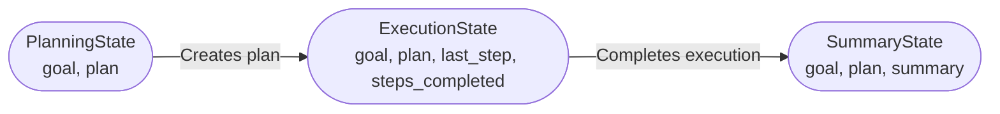

# Overview

This repository provides a template for building agentic AI projects using Python. Its goal is to offer a structured, best-practices starting point for developing modular, testable, and production-ready agentic systems. This framework is focused on LangChain/LangGraph, but is flexible enough for general-purpose agentic AI development.

## Key Features

- Simple Project Structure: Organized directories for source code (src/), tests (tests/), documentation (docs/), and CI/CD configuration (.github/).
- Editable Installation: Easily set up a development environment with pip editable mode.
- Built-in Testing: Comes with pytest configuration for unit testing.
- Example Planning Graph: Includes a sample planning graph implementation for agentic workflows.
- Security Best Practices: Guidance on managing secrets and credentials using environment variables or .env files.
- MIT Licensed: Permissive open-source license for commercial and personal use.
- Ready for CI/CD: Includes GitHub Actions workflow scaffolding for continuous integration

## Project structure

```
├── src/            # project code
├── tests/          # unit tests
├── docs/           # documentation
└── .github/        # CI configuration
```

## Agentic Core State Flow

Below is a diagram of the main states involved in agentic workflows, as implemented in `agentic_core.state_schemas`. These states are optional and customizable, but serve as a reasonable jumping off point:



    PlanningState: Defines the agent's goal and an optional plan (list of actions).
    ExecutionState: Tracks the current plan, last executed step, and all completed steps.
    SummaryState: Holds the final goal, executed plan, and a summary after all steps are done.


## Getting started
1. Create a virtual environment and install the project in editable mode:
   ```bash
   python -m pip install -e .
   ```
2. Run tests:
   ```bash
   pytest -q
   ```

3. Import the default planning graph and iterate over steps:

```python
from agentic_core.graphs.plan import plan_graph

for step in plan_graph("Hello world"):
    print(step)
```

## Security guidelines
Secrets should never be committed to the repository. Use environment variables
or a `.env` file excluded from version control for credentials.

## License
This project is licensed under the MIT License. See [LICENSE](LICENSE) for
more information.
