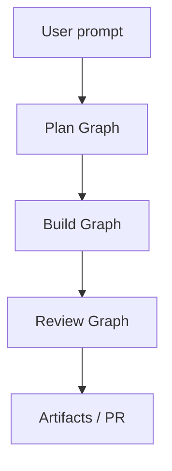

<br>

---



## 7 . “Skateboard → Scooter → Bicycle → Car” branch strategy

| Branch    | Policy                                    | Protections |
|-----------|-------------------------------------------|-------------|
| `main`    | Always deployable (latest stable “car”).  | required CI, Semantic PR title |
| `bicycle` | Feature integration and testing.          | required CI |
| `scooter` | New features once “skateboard” is solid.  | CI optional |
| `dev`     | Rapid local experiments (“skateboard”).   | none        |

Merge order: `dev` → PR into `scooter` → PR into `bicycle` → milestone release bumps `bicycle` → PR into `main`.

<br>

---

## 8 . How to cut a release

1. Merge PRs with **Conventional Commit titles** (`feat:`, `fix:`…).
2. Bump the version in `pyproject.toml` and update `CHANGELOG.md`.
3. Create and push a tag `vX.Y.Z` to GitHub.
4. Build the project with `python -m build` and upload the artifacts to PyPI
   using `twine`.
5. Draft GitHub Release notes manually from the changelog.

<br>

---

### Use it today

```bash
gh repo create my‑agent --template langgraph-mcp-template
```
